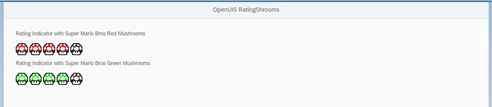

# openui5-ratingshroom
An OpenUI5 Control created for SAP Inside Track Sydney 1811.
It's just a simple demo on how to create a custom control and publish it onto UI5Lab.

## Demo
You can checkout a live demo here:

https://mauriciolauffer.github.io/openui5-ratingshroom/demo/webapp/index.html

## Author
Mauricio Lauffer

 - LinkedIn: [https://www.linkedin.com/in/mauriciolauffer](https://www.linkedin.com/in/mauriciolauffer)

## License
This project is licensed under the MIT License - see the [LICENSE](LICENSE) file for details
